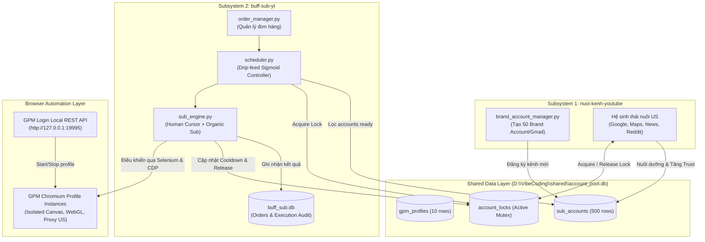
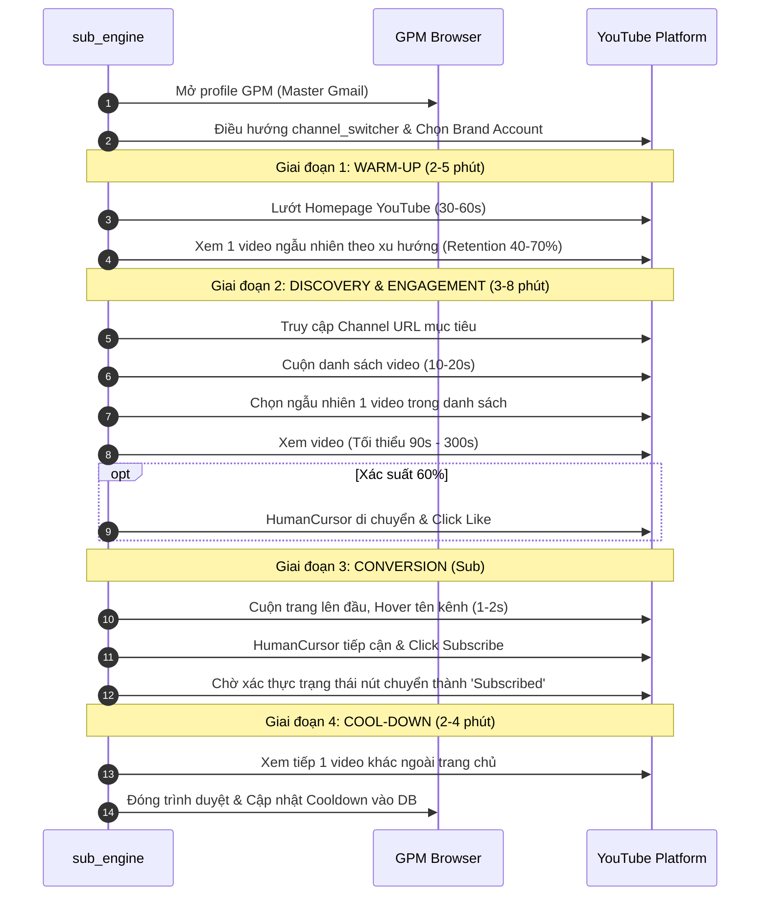

# System Architecture & Technical Design Document

**Project:** `buff-sub-yt` — Organic YouTube Subscription Engine  
**Version:** 1.0.0  
**Target Platform:** Windows 10/11 x64, Chromium (GPM Login Anti-detect Browser), Python 3.11+  

---

## 1. High-Level System Architecture

Hệ thống được thiết kế theo nguyên lý tách rời quan ngại (Separation of Concerns). Toàn bộ hạ tầng phân chia thành hai subsystem độc lập giao tiếp qua một cơ chế SQLite Bus có khóa phân tán (Distributed Lock Bus):



---

## 2. Mô hình Account Pool (500 Accounts)

### 2.1 Cấu trúc phân cấp
- **10 Gmail Master Profiles:** Mỗi profile sở hữu một vân tay trình duyệt (browser fingerprint) và Residential Proxy cố định tại Mỹ.
- **50 Brand Accounts trên mỗi Gmail:** Được tạo tuần tự thông qua `https://www.youtube.com/create_channel`, được gán identifier riêng và tên đại diện.
- **Tổng dung lượng pool:** `10 × 50 = 500 Sub Accounts`.

### 2.2 Phân hạng Độ tin cậy (Trust Tiers)

| Tier | Loại tài khoản | Tiêu chuẩn đánh giá | Tần suất sử dụng cho phép |
|---|---|---|---|
| **Tier 1** | Gmail Gốc (Master) | Đã nuôi > 30 ngày, có đầy đủ cookies hệ sinh thái Google. | Tối đa 2 lần sub/tuần/tài khoản. Ưu tiên cho các order VIP/Speed. |
| **Tier 2** | Brand Account Trưởng thành | Đã nuôi ≥ 14 ngày, đã xem ≥ 30 video, tương tác đa kênh. | 1 lần sub/3 ngày/tài khoản (Tối đa 8 sub/tháng). |
| **Tier 3** | Brand Account Đang ấm (Warming) | Đã nuôi 7 – 13 ngày, xem 10 – 29 video. | 1 lần sub/5 ngày/tài khoản (Dự phòng cho đợt cao điểm). |
| **Tier 4** | Brand Account Mới tạo (Cold) | < 7 ngày tuổi, < 10 video xem. | **CẤM DÙNG ĐỂ SUB**. Chỉ chạy trong tiến trình nuôi của Subsystem 1. |

---

## 3. Cơ chế Chống Quét & Giả lập Hành vi (Anti-Detection)

### 3.1 Đường cong di chuột Bézier (HumanCursor Integration)
Không bao giờ dùng các lệnh tự động hóa thô sơ:
- ❌ Cấm: `driver.execute_script("arguments[0].click();", btn)` — biến sự kiện thành `isTrusted: false`.
- ❌ Cấm: `ActionChains(driver).click(btn)` di chuyển theo vector đường thẳng hoàn hảo không có gia tốc.
- ✅ Sử dụng giải thuật nội suy đường cong Bézier bậc 3 kết hợp dao động ngẫu nhiên (micro-tremor) và hiện tượng vọt lố (overshoot) khi áp sát nút Subscribe:

$$B(t) = (1-t)^3 P_0 + 3(1-t)^2 t P_1 + 3(1-t) t^2 P_2 + t^3 P_3, \quad t \in [0, 1]$$

Trong đó:
- $P_0$: Tọa độ chuột hiện tại.
- $P_3$: Tọa độ ngẫu nhiên bên trong bounding box của nút Subscribe (không nhấp đúng tâm tuyệt đối).
- $P_1, P_2$: Điểm điều khiển (control points) sinh ngẫu nhiên lệch khỏi trục thẳng.

### 3.2 Vòng đời Phiên Sub hữu cơ (Sub Session Lifecycle)



---

## 4. Công thức Điều phối Drip-feed (Sigmoid Rate Limiter)

Để tránh hiện tượng "Cột dựng đứng" (Spike Anomaly) trong đồ thị tăng trưởng của YouTube Studio, tiến độ cấp sub cho một đơn hàng $N$ sub trong $T$ ngày tuân theo hàm phân phối Sigmoid:

$$S(d) = N \cdot \frac{1}{1 + e^{-k(d - d_0)}}$$

- $d$: Ngày hiện tại của chiến dịch.
- $d_0 = \frac{T}{2}$: Điểm uốn giữa chu kỳ.
- $k$: Hệ số dốc tăng trưởng tự nhiên ($k \approx 0.4 - 0.6$).

### Quy tắc an toàn (Anti-Clustering Guardrails)
1. **Cluster Threshold:** Tối đa 2 – 3 accounts được phép sub cùng 1 kênh đích trong khoảng thời gian 60 phút.
2. **Master Diversity Constraint:** Hai accounts bắt nguồn từ cùng 1 profile Gmail gốc **không bao giờ** được phép sub cùng 1 kênh đích trong vòng 48 giờ.
3. **Execution Jitter:** Mọi job được lên lịch bởi APScheduler đều cộng/trừ ngẫu nhiên một khoảng trễ $\Delta t \in [-15, +15]$ phút.

---

## 5. Thiết kế Cơ sở Dữ liệu (Database Schemas)

### 5.1 Shared Database: `D:\VibeCoding\shared\account_pool.db`

#### Bảng `gpm_profiles` (Danh mục Profile GPM)
```sql
CREATE TABLE IF NOT EXISTS gpm_profiles (
    id              TEXT PRIMARY KEY,        -- UUID của GPM profile
    gmail           TEXT NOT NULL UNIQUE,    -- Địa chỉ Gmail đăng nhập
    proxy           TEXT,                    -- Thông tin proxy host:port:user:pass
    is_active       INTEGER DEFAULT 1,       -- 1: Hoạt động, 0: Tạm ngưng
    last_used_at    TEXT,                    -- ISO8601 timestamp
    notes           TEXT
);
```

#### Bảng `sub_accounts` (Danh mục 500 Kênh Sub)
```sql
CREATE TABLE IF NOT EXISTS sub_accounts (
    id              INTEGER PRIMARY KEY AUTOINCREMENT,
    gpm_profile_id  TEXT NOT NULL,
    account_type    TEXT NOT NULL,           -- 'gmail_root' | 'brand_account'
    channel_id      TEXT UNIQUE,             -- @handle hoặc UCxxxxxxxx
    channel_url     TEXT,                    -- https://www.youtube.com/...
    switch_name     TEXT,                    -- Tên hiển thị trên menu channel_switcher
    niche           TEXT DEFAULT 'general',  -- Lĩnh vực nội dung
    
    warmup_status   TEXT DEFAULT 'cold',     -- 'cold' | 'warming' | 'ready' | 'suspended'
    warmup_days     INTEGER DEFAULT 0,       -- Số ngày được nuôi thực tế
    warmup_videos   INTEGER DEFAULT 0,       -- Tổng số video đã xem khi nuôi
    warmup_since    TEXT,
    ready_since     TEXT,
    
    total_subs_done INTEGER DEFAULT 0,       -- Tổng số kênh đã sub từ trước đến nay
    subs_this_month INTEGER DEFAULT 0,       -- Số kênh đã sub trong 30 ngày qua
    last_sub_at     TEXT,
    cooldown_until  TEXT,                    -- Thời điểm hết hạn cooldown
    
    is_active       INTEGER DEFAULT 1,
    created_at      TEXT DEFAULT (datetime('now')),
    FOREIGN KEY(gpm_profile_id) REFERENCES gpm_profiles(id)
);
CREATE INDEX IF NOT EXISTS idx_sub_accounts_status ON sub_accounts(warmup_status, cooldown_until, is_active);
CREATE INDEX IF NOT EXISTS idx_sub_accounts_gpm ON sub_accounts(gpm_profile_id);
```

#### Bảng `account_locks` (Cơ chế Khóa Tránh Xung Đột)
```sql
CREATE TABLE IF NOT EXISTS account_locks (
    account_id      INTEGER PRIMARY KEY,
    locked_by       TEXT NOT NULL,           -- 'nuoi_kenh' hoặc 'buff_sub'
    locked_at       TEXT DEFAULT (datetime('now')),
    expires_at      TEXT NOT NULL,           -- Tự động giải phóng nếu timeout
    FOREIGN KEY(account_id) REFERENCES sub_accounts(id)
);
```

---

### 5.2 Internal Database: `D:\VibeCoding\buff-sub-yt\data\buff_sub.db`

#### Bảng `orders` (Quản lý Đơn hàng)
```sql
CREATE TABLE IF NOT EXISTS orders (
    id              INTEGER PRIMARY KEY AUTOINCREMENT,
    channel_url     TEXT NOT NULL,           -- URL kênh nhận sub
    channel_id      TEXT,                    -- @handle hoặc ID kênh
    target_subs     INTEGER NOT NULL,        -- Mục tiêu số sub (ví dụ: 1000)
    delivered       INTEGER DEFAULT 0,       -- Số sub đã thực hiện thành công
    status          TEXT DEFAULT 'pending',  -- 'pending' | 'running' | 'paused' | 'completed' | 'failed'
    daily_cap       INTEGER DEFAULT 50,      -- Hạn mức tối đa sub/ngày
    priority        INTEGER DEFAULT 5,       -- 1 (cao nhất) -> 10 (thấp nhất)
    customer_note   TEXT,
    created_at      TEXT DEFAULT (datetime('now')),
    completed_at    TEXT
);
```

#### Bảng `sub_history` (Nhật ký Thực thi)
```sql
CREATE TABLE IF NOT EXISTS sub_history (
    id              INTEGER PRIMARY KEY AUTOINCREMENT,
    order_id        INTEGER NOT NULL,
    account_id      INTEGER NOT NULL,        -- Liên kết ID trong sub_accounts
    channel_id      TEXT NOT NULL,
    watch_seconds   INTEGER,                 -- Số giây xem thực tế trước khi sub
    did_like        INTEGER DEFAULT 0,       -- 1: Đã like, 0: Không like
    sub_success     INTEGER DEFAULT 0,       -- 1: Thành công, 0: Thất bại
    fail_reason     TEXT,
    executed_at     TEXT DEFAULT (datetime('now')),
    FOREIGN KEY(order_id) REFERENCES orders(id)
);
CREATE INDEX IF NOT EXISTS idx_sub_history_order ON sub_history(order_id);
```

---

## 6. Chiến lược Xử lý Rủi ro Kỹ thuật

| Rủi ro | Mức độ | Biểu hiện | Giải pháp kỹ thuật tự phục hồi (Self-Healing) |
|---|---|---|---|
| **Thay đổi Polymer Shadow DOM của YouTube** | Cao | `NoSuchElementException` khi tìm nút Subscribe/Like. | Áp dụng chuỗi fallback 4 lớp selectors kết hợp JavaScript shadowRoot traversing. Hệ thống tự động cảnh báo nếu tỷ lệ lỗi liên tiếp vượt quá 3 lần. |
| **Google Account Clustering Detection** | Rất cao | Sub bị quét tụt hàng loạt (Purge), Gmail nhận cảnh báo bảo mật. | Enforce tuyệt đối: Jitter timing ngẫu nhiên, giới hạn 2-3 sub/kênh/giờ, diversity kiểm tra nguồn Gmail gốc trước khi dispatch job. |
| **GPM API Timeout / Socket Error** | Trung bình | Profile treo, driver đóng đột ngột. | Tích hợp module auto-dismiss Win32 Dialog, watchdog kiểm tra tiến trình Chromium, retry an toàn tối đa 2 lần kèm giải phóng lock. |
